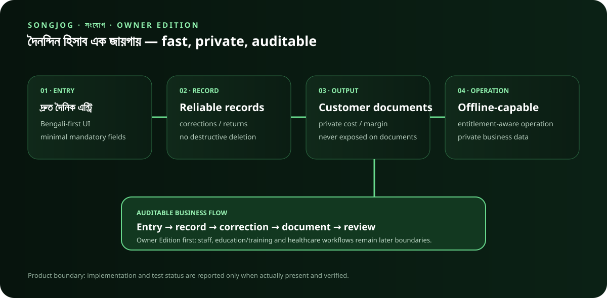

# Songjog (সংযোগ)

Songjog (সংযোগ) is an Android-first, Bengali-first business and institution operations app for shops, service businesses, and later education/training and healthcare institutions.

## Product promise

**দৈনন্দিন হিসাব এক জায়গায়।**

The Owner Edition prioritizes extremely fast daily entry, reliable financial records, polished customer documents, private cost/margin data, and adaptive workflows by business type.

## Current product boundary

The first commercial release is Owner Edition. Staff/team, customer/student/guardian experiences, public-facing features, advanced integrations, education/training workflows, and healthcare workflows are architecturally prepared but must not delay the first owner release.

## Non-negotiables

- Bengali-first and English-first are mutually pure UI modes.
- User-entered business data is not treated as UI translation content.
- Mandatory fields are minimal.
- Posted financial records are corrected through auditable adjustments/returns/refunds rather than destructive deletion.
- Actual cost and margin are private and never appear on customer-facing documents.
- Trial/licensing is server-authoritative; public source code contains no production secrets.
- Offline operation must remain useful within the configured entitlement policy.

## Development truth

The repository is public. Documentation may describe intended architecture, but implementation and test status must only be reported when actually present and verified.

## Documentation

See `docs/` for the Owner Edition UX, trial/licensing, public-repository activation, architecture, business-type model, data model, security, roadmap, research notes, and release gates.
