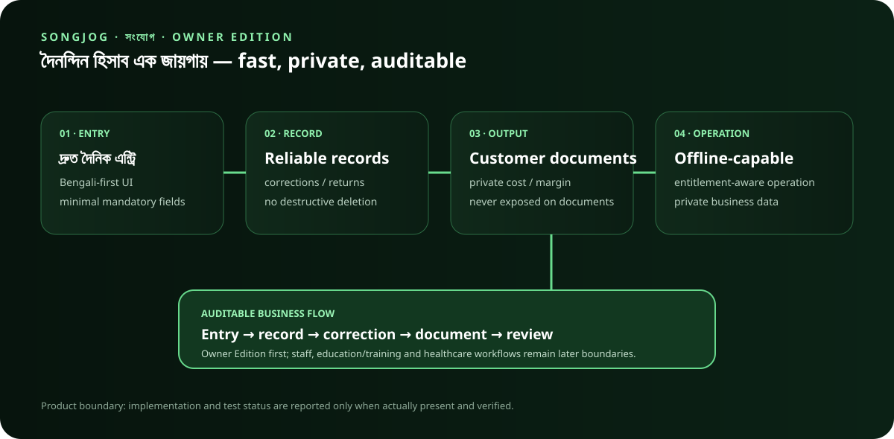

<!-- deterministic-state-bridge: songjog -->

**Machine-generated operational state:** see [`.repo/STATUS.md`](.repo/STATUS.md) (generated by `tools/repo_knowledge`). For cross-project SKB registry state, see [`songjog.json`](https://github.com/soobujmiah/skb/blob/main/projects/registry/songjog.json) in the parent SKB repository (`soobujmiah/skb`).
# Songjog (সংযোগ)

Songjog (সংযোগ) is an Android-first, Bengali-first business and institution operations app for shops, service businesses, and later education/training and healthcare institutions.

## Product promise

**দৈনন্দিন হিসাব এক জায়গায়।**

The Owner Edition aims to provide fast daily entry, reliable financial records, customer documents, private cost/margin data, and workflows adapted to business type. These are release goals; see the 14-flow status in `docs/MVP_ACCEPTANCE.md` for what the current app can actually do.

## Current product boundary

The first commercial release is Owner Edition. Staff/team, customer/student/guardian experiences, public-facing features, advanced integrations, education/training workflows, and healthcare workflows are planned for later work and must not delay the first owner release.

## Release requirements (not all implemented yet)

- Bengali-first and English-first are mutually pure UI modes.
- User-entered business data is not treated as UI translation content.
- Mandatory fields are minimal.
- Posted financial records are corrected through auditable adjustments/returns/refunds rather than destructive deletion.
- Actual cost and margin are private and never appear on customer-facing documents.
- Trial/licensing is server-authoritative; public source code contains no production secrets.
- Offline operation must remain useful within the configured entitlement policy.

## Development truth

The repository is public. Documentation may describe intended architecture, but implementation and test status must only be reported when actually present and verified.

## Documentation

See `docs/` for the Owner Edition UX, trial/licensing, public-repository activation, architecture, business-type model, data model, security, roadmap, research notes, and release gates.
